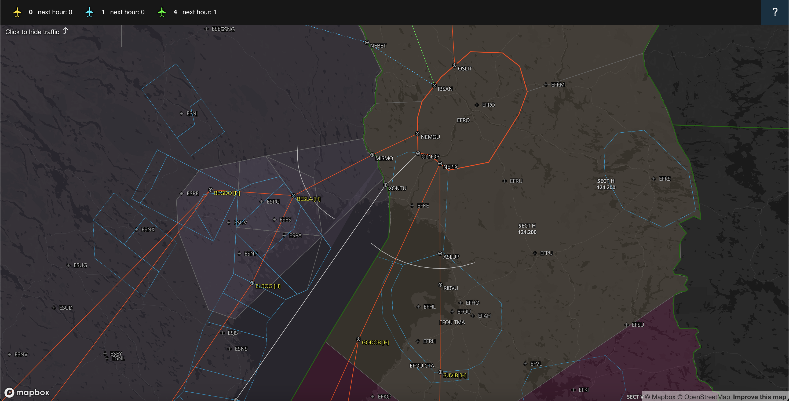
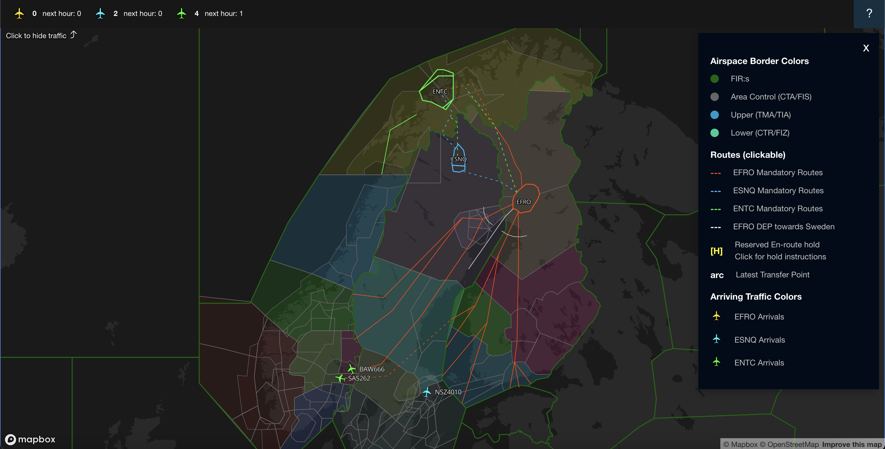

# VATSIM Scandinavia Fly and See Santa 2024

This is a map application displaying the following data:
- Planned ACC Sectorization in Finland, Sweden and Norway
- Static airspace borders (FIZ, CTR, TMA, FIA, CTA etc.)
- Live arriving traffic to EFRO, ESNQ and ENTC in different colors
    - position, flight level and speed
    - notification if arrival route is invalid (EFRO only)
    - arrival count and expected arrival count in the next one hour
- Mandatory arrival routes and airport connecting routes to EFRO, ESNQ and ENTC
- Coordinated transfer points (arcs)

